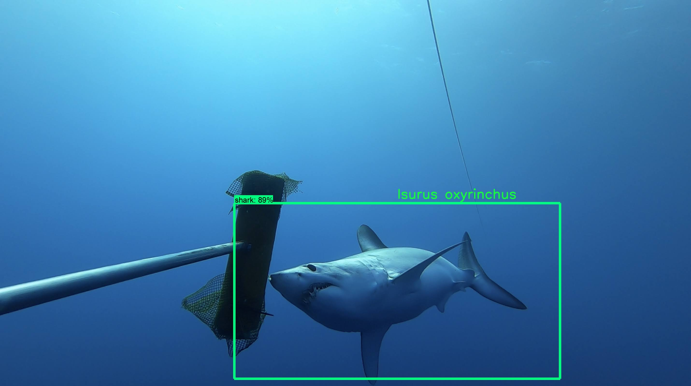

# Shark Detector v2
<p align="center">
  
</p>
We created a database of over 70,000 shark images covering 219 species of sharks. The Shark Detector (SD) is an open source package designed to identify sharks from visual media and classify 47 species with 70% accuracy using transfer learning and convolutional neural networks (CNNs).
<p>
<p align="center">
  
</p>

## Models and Data

The SD is composed of an object-detection model, Shark Locator (SL), and multiple image classifiers packaged into the Shark Classifier (SC). The Shark Identifier (SI) is a binary classification scheme which is more tailored to big data mining.
1) Shark Locator (SL) -- object-detection
2) Genus-specific classifier (GSC) -- image classifier (parent node)
3) Species-specific classifier (SSCg) -- image classifier (child node of genus)

We developed the SC as a hierarchical framework for taxonomically classifying located shark images. We trained one genus-specific model and a series of local species-specific models - one for each genus. The SC ingests the filtered shark images and classifies them at the genus level with the genus-specific classifier (GSC). Then, depending on the genus, a species-specific classifier (SSCg) will predict the most likely species. For the GSC, we trained 45,101 images across 26 genus classes. We trained 18 SSCg models with 24,391 images. The SC and SI models are continusously trained as new images are ingested.

You can download the saved model weights [here.](https://drive.google.com/drive/folders/1KdVkSn4avPCa4iGjLp6Lf8IVSEAURQqs?usp=sharing)

The dataset structure of training the GSC and SSCg is shown below
```
    ├── dataset                           <- root
        ├── training_set   <- GSC structure <- training set folders        
        |   ├── Alopias                     <- image files
                ├──Alopias vulpinus           <- SSCg structure
                ├──Alopias species 
        |   ├── Carcharhinus
        |   ├── Carcharias
        |  
        ├── test_set              
        |   ├── Alopias      
                ├──Alopias vulpinus  
                ├──Alopias species
        |   ├── Carcharhinus
        |   ├── Carcharias
``` 
## Code
This model implements the Keras package with a Tensorflow backend entirely in Python.  

### Requires
- [Python 3.8.10](https://www.python.org/downloads/)
- [Tensorflow 2.9.2](https://www.tensorflow.org/)
- [Keras 2.9.0](https://keras.io/)
- [PIL 9.1.1](https://pillow.readthedocs.io/en/stable/)
- [OpenCV 4.7.0.72](https://github.com/skvark/opencv-python)
- [pandas 1.2.3](https://pandas.pydata.org)
- [numpy 1.22.3](https://www.numpy.org)

The SD works best with GPU acceleration 
- CUDA version 11.0 
- NVIDIA driver 450.51.05

# Installation
Follow these instructions to install and run the Shark Detector application: 
### Mac / Linux
1. DOWNLOAD the tar file **models** from [models](https://drive.google.com/drive/folders/1KdVkSn4avPCa4iGjLp6Lf8IVSEAURQqs?usp=sharing) (~3GB)
2. LOCATE (probably in your Downloads folder) and EXTRACT tar file
```
tar -xvf models.tar.gz
```
3. CLONE the repository and create your Python environment 
```
git clone https://github.com/JeremyFJ/Shark-Detector.git
cd Shark-Detector
virtualenv .venv
source .venv/bin/activate
pip install -r requirements.txt
```
4. MOVE your **models/** directory to your cloned repository **Shark-Detector/**
5. Run the SD on a test video (it may take ~10 minutes to first load the model)
```
python video_SD.py test.mp4
```
6. If there are no errors, check your `frames/` and `spreadsheets/` for the detection output
7. NOTE: videos that have been processed are moved from `Shark-Detector/media/video/` to `Shark-Detector/media/processed_video/` </p>
Install guide [full video](https://youtu.be/x0l1PZdMWpc)</p>


### Windows (under maintenance)

## Run
This repository currently instructs on how to detect and classify shark species from MP4 videos

See [sharkPulse](http://sharkpulse.cnre.vt.edu/can-you-find-a-shark/) to classify single images

- Move your video to `Shark-Detector/media/video/`
- Navigate to your repository directory `Shark-Detector/`
- Process one video:
`python video_SD.py [video name]`
- Process all videos in folder:
`python video_SD.py ALL`

## Results
`spreadsheets/[video name].csv` shows a csv file of all frames extracted and sharks classified
`frames/` outputed shark detected frames that are listed in the spreadsheet. Frames are labeled with the video name and the amount of seconds passed 

## Check out
- [Schisto-parasite-classification](https://github.com/deleo-lab/schisto-parasite-classification) Based on a multi-classification model trained to identify vector parasites of Schistosomiasis
- [Validation Monitor](http://sharkpulse.cnre.vt.edu/can-you-recognize/) Crowdsource shark images from around the world and involve citizen scientists to validate sightings
- [SeaQL](http://35.245.242.176/seaql/) Research Lab

## Contact
- Data: jjeremy1@vt.edu
- Model: jjeremy1@vt.edu, zacycliu@stanford.edu, pchimote@vt.edu

